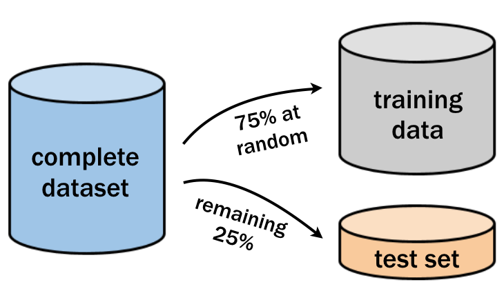

### ML: decision trees

This is a simple example about how to built a decision tree. For this example, we will use the package `rpart`

```{r}
library(rpart)

soil_model <- rpart(pH ~ P + coarse_sand, data = soil_data, method = "anova", control = rpart.control(cp = 0))
```
#### Visualization of a decision tree

The structure of a decision/classification trees can be depicted visually, which helps to understand how the tree makes its decisions.

```{r, message=FALSE, warning=FALSE}
# Load the rpart.plot package
library(rpart.plot)

# Plot the soil_model with default settings
rpart.plot(soil_model)

```

#### Why do some branches split?
A classification tree grows using a divide-and-conquer process. Each time the tree grows larger, it splits groups of data into smaller subgroups, creating new branches in the tree. This process always looks to create the split resulting in the greatest improvement to purity (subgroup homogeneity).

Classification trees tend to grow easily due to they divide the data using one variable value, producing the most pure partition each time:


```{r, echo = FALSE}
plot(soil_data$P, soil_data$coarse_sand, col = soil_data$pH, main="Decision tree splits",
   xlab="P [%]", ylab="Coarse sand [%]")
abline(v=7.4, col="black")
segments(x0 = 7.4,
         x1 = 90,
         y0 = 8.05,
         y1 = 8.05,
         col = "black")
segments(x0 = 7.4,
         x1 = 90,
         y0 = 1.1,
         y1 = 1.1
         )
segments(x0 = 13,
         x1 = 13,
         y0 = 1.1,
         y1 = 8.05, 
          )
text(7.4, 25, "S1", pos = 3)
text(80, 8.05, "S2", pos = 4)
text(80, 1.1, "S3", pos = 4)
text(13, 4, "S4", pos = 3)
```

#### Creating random test datasets

Before building a more sophisticated pH model, it is important to hold out a portion of the data to simulate how well it will predict the pH of unknown data points.

As depicted in the following image, you can use 75% of the observations for training and 25% for testing the model.

<center>
{width="300"}
</center>


The `sample()` function can be used to generate a random sample of rows to include in the training set. Simply supply it the total number of observations and the number needed for training. Then we can use the resulting vector of row IDs to subset the samples into training and testing datasets as:


```{r}
# Determine the number of rows for training
nrow(soil_data)
nrow(soil_data) * 0.75
# Create a random sample of row IDs
sample_rows <- sample(nrow(soil_data), nrow(soil_data) * 0.75)

# Create the training dataset
soil_train <- soil_data[sample_rows, ]

# Create the test dataset
soil_test <- soil_data[-sample_rows, ]
```
```{css, echo=FALSE}
.scroll-100 {
max-height: 100px;
overflow-y: auto;
background-color: inherit;
}
```
```{r, echo = TRUE, class.output="scroll-100"}
str(soil_train)
str(soil_test)
```

#### Building and evaluating a larger tree

Previously, you created a simple decision tree that use the `P` and `coarse_sand` content to predict `pH`. We have some more additional soil information, such `K`, `Mg`, `soil_type_ka4`, etc. That may be useful for making more accurate predictions.

Using all of the available applicant data, build a more sophisticated lending model using the random training dataset created previously. Then, use this model to make predictions on the testing dataset to estimate the performance of the model on future soil points.


### ML: random forest
