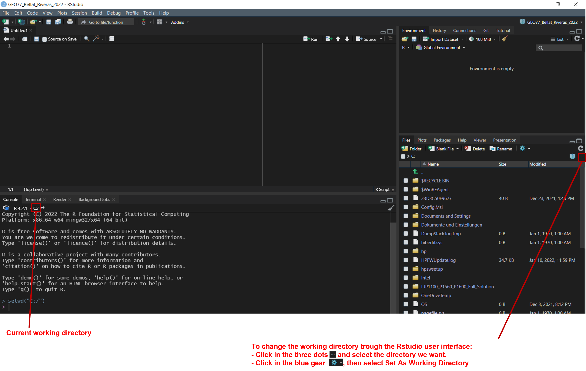
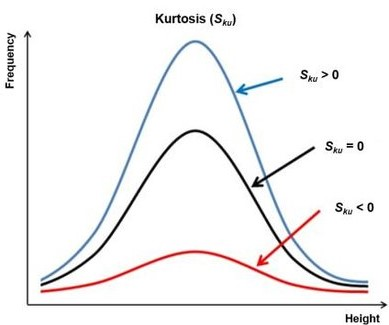

```{r setup, include=FALSE}
knitr::opts_chunk$set(echo = TRUE)
```

# Exploratory data analysis in R for spatial modeling

## Basic data management

### Setting up a working directory (working directory)

As with most of the projects, we start choosing a working directory to indicate R where are our files.

```{r, eval=FALSE}
getwd()                       # Current working directory 
setwd("C:/GEO77_R_course") 	  # Set a working directory
setwd("C:\\GEO77_R_course")   # another valid way to select the same working directory
setwd("C:\GEO77_R_course")    # an invalid way of selecting the same working directory
```

#### And if I do not want to write code?



-   or go to Session/Set Working Directory/Choose directory... and select folder

-   or press `Ctrl+⇧Shift+H` and select folder

**Why?** 

+   Clarity 
+   Simplification of data management 
+   Facilitates access to our data

### Loading data

R has the ability to load multiple file formats, which can be further extended through packages.

Reading a dataset `read.table()`

```{r}
soil_data <- read.table("./data/soil_data.txt", header = TRUE)
```
```{r}
names(soil_data)
```
```{css, echo=FALSE}
.scroll-200 {
max-height: 200px;
overflow-y: auto;
background-color: inherit;
}
```
```{r,class.output="scroll-200"}
str(soil_data)
```
```{r, echo=FALSE, message=FALSE}
library(dplyr)
soil_data %>%
  kableExtra::kbl() %>%
  kableExtra::kable_classic(full_width = T, html_font = "Cambria", lightable_options = "basic") %>%
  kableExtra::scroll_box(width = "100%", height = "200px")
```


#### don't forget!
<center>
{width="200"}
</center>

### Writing data `write.table()`

R also allows to export our output/results in different formats:

```{r}
write.table(soil_data, file = "output/this_is_a_copy_of_soil_data_made_with_R.csv", sep = ",",
            row.names = FALSE, col.names = TRUE)

```
## Statistical evaluation

When we work with data, is important to describe our data to understand it better. There are a wide variety of statistics used to describe or summarize data in terms of central tendency, shape, position, etc.

```{r}
pH <- soil_data$pH
K <- soil_data$K
```
### Descriptive statistics
```{r}
mean(pH)
median(pH)
min(pH)
max(pH)
range(pH)
sd(pH)
quantile(pH)
summary(pH)
```


some functions are not included in base R, but implemented via packages. E.g. `moments`

```{r}
library(moments)
skewness(pH)
```
Skewness indicates if our data distribution is symmetric or not:


```{r}
kurtosis(pH)
```
Kurtosis describe is how long is the tail of our data distribution:



### Correlation

Pearson correlation coefficient `cor()`

$${r_{xy}=\frac{\sum_{i = 1}^{n}(x_i-\overline{x})(y_{i}-\overline{y})}{\sqrt{\sum_{i = 1}^{n}(x_{i}-\overline{x})^2}{\sqrt{\sum_{i = 1}^{n}(y_{i}-\overline{y})^2}}}}$$

where:

-   $n$ is sample size
-   $X_{i}$, $Y_{i}$ are the individual sample points indexed with $i$
-   $\overline{x} = \frac{1}{n}\sum_{x = 1}^{n} x_{i}$ (the sample mean);

and analogously for ${\bar {y}}$

Examples:


So now with our data...

```{r}
cor(pH, K)
```

```{r, echo=FALSE}
plot(pH, K)
```

[Spurious correlations](http://tylervigen.com/spurious-correlations)

### Linear regression `lm()`

in R, the linear models are written as `lm(y ~ x, data)`

Example:

```{r}
# loading some example data
pH <- c(7.25, 7.91, 5.43, 8.96, 3.21, 4.32, 6.45, 7.22, 9.1, 6.77, 8.43, 5.51, 7.5, 6.64, 4.55, 2.18, 9.79, 7.65)
Corg <- c(4.23, 3.22, 3.1, 7.39, 3.11, 2.37, 5.51, 5.01, 7.26, 6.4, 6.38, 3.37, 8.29, 6.93, 2.87, 0.12, 7.57, 9.4)

```

```{r, echo=FALSE}
plot(pH, Corg)
```

```{r, fig.show="hold", out.width="50%"}
data <- as.data.frame(cbind(pH, Corg))
linearModel <- lm(pH ~ Corg , data = data)
summary(linearModel)
plot(linearModel)
```
When running this command, we obtain a set of 4 plots that are out of the scope of this "introduction", but for the curious ones:

+   **Residuals vs Fitted **: The residuals are distributed following a systematic pattern around the value 0, indicating that the *linear* regression is not the best. The residuals are also more concentrated in the center, while towards the extremes they show less dispersion, which could indicate heterogeneity among the error variances (heteroscedasticity). Some residuals stand out, indicating the possible presence of outliers.
+   **Normal Q-Q**: It compares a theoretical normal distribution with the residuals of our model. It should show a straight line for normality assumption and should not show systematic pasterns (should be randomly distributed around that straight line).
+   **Scale-location**: it shows if residuals are spread equally along the ranges of predictors. This is how you can check the assumption of equal variance (homoscedasticity). It’s good if you see a horizontal line with equally (randomly) spread points.
+   **Residuals vs leverage**: Unlike the other plots, this time the patterns are not relevant. We look for outlying values in the upper or lower right corner. These places are where cases with a large weight in the linear regression can be located. Look for cases outside the dotted lines, which means they have high Cook's distance values.

This is just a visual check, not an air-tight proof, so it is somewhat subjective. But it allows us to see at-a-glance if our assumption is plausible, and if not, how the assumption is violated and what data points contribute to the violation.

Source: [Understanding Diagnostic Plots for Linear Regression Analysis](https://data.library.virginia.edu/diagnostic-plots/#:~:text=Scale%2DLocation,equally%20(randomly)%20spread%20points.)


### Coefficient of determination with Pearson correlation coefficient `cor()`

$$R^2≡1-\frac{\sum(y_{i}-\hat{y_{i}})^2}{\sum(y_{i}-\overline{y})^2}$$

$$R^2=r×r$$

```{r}
cor(data$pH, linearModel$fitted.values) * 
cor(data$pH, linearModel$fitted.values)
```

### root mean squared error (RMSE)

$$RMSE=\sqrt{\frac{1}{n}\sum_{i = 1}^{n}{(\hat{y_{i}}-y_{i})^2}}$$

```{r}
sqrt(1 / length(rbind(linearModel$residuals * sum(rbind(linearModel$residuals) ^ 2))))

```
### Function for the root mean squared error (RMSE)

Base R does not include a function for RMSE in base R, but in R we can create custom functions as follows:

```{r, eval = FALSE}
function_name <- function(input_x, input_y, ...) {
  some_operations
}

```{r}
rmse <- function(x, y) {
  sqrt(mean((x - y) ^ 2))
}
```

Requires input

```{r}
rmse(linearModel$fitted.values, Corg)
```
## Visualization with plots

[The R Graph Gallery](https://www.r-graph-gallery.com/index.html)

### Boxplots `boxplot()`
```{r, echo = FALSE}
pH <- c(7.25, 7.91, 5.43, 8.96, 3.21, 4.32, 6.45, 7.22, 9.1, 6.77, 8.43, 5.51, 7.5, 6.64, 4.55, 2.18, 9.79, 7.65)
Corg <- c(4.23, 3.22, 3.1, 7.39, 3.11, 2.37, 5.51, 5.01, 7.26, 6.4, 6.38, 3.37, 8.29, 6.93, 2.87, 0.12, 7.57, 9.4)

```
```{r}
boxplot(pH, Corg, names = c("pH value", "Corg content"), ylab = "pH value and Corg content")

```

+   Data to be displayed: pH and Corg
+   Labeling of the x-axis: names = c("pH value", "Corg content")
+   Labeling of the y-axis: ylab = "pH value and Corg content".

What does the boxplot show?

### Histograms `hist()`

```{r}
hist(pH,
     xlab = "pH value", 
     ylab = "Frequency", 
     main = ""
     )
```

### Density plots `plot(density()`

```{r}
plot(density(pH), 
     xlab = "pH value",
     ylab = "Frequency", 
     main = ""
     )
```

### Scatterplots `plot(x, y)`

```{r}
plot(pH, 
     Corg, 
     xlab = "pH value",
     ylab = "Corg content"
     )

```

### Design options

Directly in the graphic routines (help with `?par`)

+   Set colors with `col = ...`
+   Set symbol properties with `pch = ...`, sizes with `cex = ...`
+   Set title with `main = ...`, axis label with `xlab = ...`, `ylab = ...`
+   Set drawing area with `xlim = ...`, `ylim = ...`

After drawing a graphic

+   Complete lines and points with `lines(...)` or `points(...)` respectively.
+   Add captions (texts) with `text(...)` or `mtext(...)`
+   Complete titles with `title(...)`
+   Complete legend with `legend(...)`

Output adjustment

+   `main` Title of the diagram
+   `xlab` labeling of the x-axis
+   `ylab` labeling of the y-axis
+   `breaks` frequency classes number of bars
+   `col` color filling of the bars
+   `cex` gradual scaling of text size

```{r}
hist(pH, 
     xlab = "pH value", 
     ylab = "Frequency", 
     main = "",
     breaks = seq(0, 10, 2), 
     col = "red",
     cex = 0.5
     )

```

## All roads lead to `R`ome

When working with code, it is very common that there are several ways to solve the same problem.

**Exercise:** Frequency distribution grain size types KA4

+   Calculate all statistical parameters Create boxplots and histograms for clay content and pH (CaCl~2~)
+   Calculate correlations between for clay content, pH (CaCl~2~) and all other parameters
+   Evaluation of the results

And now for the frequency distribution grain size types KA4!

**Hint:** The three different version are made with a `barplot()`, `plot()` and `hist()` 

```{r, echo = FALSE}
soil_data <- read.table("data/soil_data.txt", header = TRUE)
```

### Variant A

```{r, echo = FALSE}

soil_type <- as.data.frame(table(soil_data$soil_type_ka4))

barplot(soil_type$Freq, space = 0, names = soil_type$Var1, 
                    xlab = "Soil type", ylab = "Frequency", 
                    main = "Frequency diagram KA4 Soil types") 

```

### Variant B

```{r, echo = FALSE}

plot(factor(soil_data$soil_type_ka4), 
                  xlab = "Soil type", 
                  ylab = "Frequency", 
                  main = "Frequency diagram KA4 Soil types")
```

### Variant C

```{r, echo = FALSE}
soil_type <- as.data.frame(table(soil_data$soil_type_ka4))
hist(as.numeric(factor(soil_data$soil_type_ka4)),
                  breaks = c(0, 1, 2, 3, 4, 5, 6, 7, 8, 9),
                  freq = TRUE,
                  xaxt = "n",
                  xlab = "Soil type",
                  ylab = "Frequency",
                  main = "Frequency diagram KA4 Soil types")

axis(side = 1, at = seq(0.5, 8.5, 1), labels = soil_type$Var1)
```

#### Solution

If you can't solve it by yourself, you can look at the code and try to understand it, but I encourage you to try.

```{r, class.source = 'fold-hide', eval=FALSE}
soil_type <- as.data.frame(table(soil_data$soil_type_ka4))
# Variant A
barplot(soil_type$Freq, space = 0, names = soil_type$Var1, 
                    xlab = "Soil type", ylab = "Frequency", 
                    main = "Frequency diagram KA4 Soil types")

# Variant B
plot(factor(soil_data$soil_type_ka4), 
                  xlab = "Soil type", 
                  ylab = "Frequency", 
                  main = "Frequency diagram KA4 Soil types")

# Variant C
hist(as.numeric(factor(soil_data$soil_type_ka4)),
                  breaks = c(0, 1, 2, 3, 4, 5, 6, 7, 8, 9),
                  freq=TRUE,
                  xaxt = "n",
                  xlab = "Soil type",
                  ylab = "Frequency",
                  main = "Frequency diagram KA4 Soil types")
axis(side = 1, at = seq(0.5, 8.5, 1), labels = soil_type$Var1)

```


## Multiple plots in one figure

When you set graphical parameters in Rstudio using this method, it is important to set the properties, plot the figures and reset the properties to the way they were before. Otherwise, every time we plot something, it will follow the set parameters.

```{r, eval=FALSE}
par(                              # set or query graphical parameters
  mfrow = c(1, 3),                # 1 x 3 pictures on one plot, equivalent to mfcol = c(3, 1)
  mar = c(5.1, 4.1, 4.1, 2.1),    # margins as c(bottom, left, top, right)
  oma = c(0, 0, 0, 0),            # outer margins in lines of text as c(bottom, left, top, right)
  mgp = c(3, .1, 0),              # margins line for axis title, axis label and axis line
  las = 0,                        # label axis style 
  cex.lab = 1,                    # size of the labels
  cex.axis = 1,                   # size of the axis annotation 
  xpd = FALSE                     # If FALSE, all plotting is clipped to the plot region, if TRUE, all plotting is clipped to the figure region, and if NA, all plotting is clipped to the device region.
    )

plot(…); plot(…); plot(…)

par(mfrow = c(1, 1), 
    mar = c(5.1, 4.1, 4.1, 2.1), 
    oma = c(0, 0, 0, 0), 
    mgp = c(3, 1, 0), 
    las = 0, 
    cex.lab = 1, 
    cex.axis = 1,
    )

```

```{r, echo=FALSE, fig.show="hold", out.width="33%"}
par(mar = c(5.1, 4.1, 4.1, 2.1))
soil_type <- as.data.frame(table(soil_data$soil_type_ka4))

barplot(soil_type$Freq, space = 0, names = soil_type$Var1, 
                    xlab = "Soil type", ylab = "Frequency", 
                    main = "Frequency diagram KA4 Soil types")

plot(factor(soil_data$soil_type_ka4), 
                  xlab = "Soil type", 
                  ylab = "Frequency", 
                  main = "Frequency diagram KA4 Soil types")
soil_type <- as.data.frame(table(soil_data$soil_type_ka4))
hist(as.numeric(factor(soil_data$soil_type_ka4)),
                  breaks = c(0, 1, 2, 3, 4, 5, 6, 7, 8, 9),
                  freq=TRUE,
                  xaxt = "n",
                  xlab = "Soil type",
                  ylab = "Frequency",
                  main = "Frequency diagram KA4 Soil types")

axis(side = 1, at = seq(0.5, 8.5, 1), labels = soil_type$Var1)


```

## Plots file output

In R it is possible to export images in the most common formats and can be extended from packages. The output format must be specified and the file will be generated by default in our working directory.

```{r, eval=FALSE}
tiff("filename.tiff", width = 21, height = 8, units = "cm", res = 300)

par(…)
	plot(…); plot(…); plot(…)
par(…)

dev.off()
```

## Do I have to learn all these commands by heart?

**No!** R and Rstudio provide several tools to help us do this:

+ **comments**: when running our script, `R` will ignore all the text that start with `#`. Is a good practice to comment our code, is very useful if somebody else need to understand your code or for yourself in the future. In Rstudio, you can comment/uncomment the selected text with `Ctrl+⇧Shift+C`
+ **autocomplete**: Rstudio will suggest possible parameter for a function. Inside a function press the key `Tab ↹`, and it will display a list with the possible parameters for that function. move up `↑` and down `↓` and select with `↵ Return`.
+ **help**: you can select a function and press `F1`, write `?function`, `help(function)` or `help('function')` in the Rstudio console, and it will display the corresponding documentation for that function in the help panel.
+ **cheatsheets**: It is very common that for the most popular packages there are [cheat sheets](https://rstudio.cloud/learn/cheat-sheets) summarizing the most important functions

## Libraries

Many functions are not included in the basic version of R. Therefore, there is an almost confusing variety of additional libraries for special applications.
Examples:

+   `ggplot2` and `lattice` for advanced graphics
+   `dplyr`, `reshape2` and `tidyr` for data manipulation
+   `sp` and `sf` for spatial data (shapefiles, geopackage, etc.)
+   `raster`, `terra`, `stars` for spatial raster data
+   `caret` as wrapping function for machine-learning libraries
+   `RQGIS` and `RSAGA` as bridges to QGIS and SAGA GIS
+   Currently, 18875 available packages in the [CRAN package repository](https://cran.r-project.org/web/checks/check_summary_by_package.html#summary_by_package)
+   some others available on [Github](https://github.com/)

## How to load a library?


In the console or the script

```{r, eval=FALSE, collapse=TRUE}
install.packages(ggplot2)		# install a library
library(ggplot2)			    # loading a library
require(ggplot2)
detach(ggplot2)			        # Removing a loaded library

rp <- c("DescTools", "rstudioapi") 				# required packages
ip <- rp[!(rp %in% installed.packages()[, "Package"])] 	# subset packages

if(length(ip)) install.packages(ip, dependencies = TRUE)	# install packages

lapply(rp, require, character.only = TRUE) 			# load packages
rm(np, rp) 								# remove vectos

```
## References

[R for Data Science](https://r4ds.had.co.nz/)