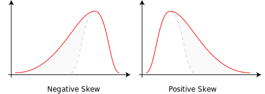

```{r setup, include=FALSE}
knitr::opts_chunk$set(echo = TRUE)
```

# Introduction to R for spatial modeling

## Basic data management

### Reading data

#### Setting up a working directory (working directory)

```{r, eval=FALSE}
getwd() # Current working directory 
setwd("C:/Users/EarthShape/Desktop/1-Projects/Earthshape/GEO77_R_course") 	# Set a working directory
setwd("C:\\Users\\EarthShape\\Desktop\\1-Projects\\Earthshape\\GEO77_R_course") 	# another valid way to select the same working directory
setwd("C:\Users\EarthShape\Desktop\1-Projects\Earthshape\GEO77_R_course") # an invalid way of selecting the same working directory
```

#### And if I do not want to write code?


-   or go to Session/Set Working Directory/Choose directory... and select folder

-   or press `Ctrl+⇧Shift+H` and select folder

**Why?** 

+   Clarity 
+   Simplification of data management 
+   Facilitates access to our data

### Loading data

R has the ability to load multiple file formats, which can be further extended through packages.

Reading a dataset `read.table()`

```{r}
soil_data <- read.table("./data/soil_data.txt", header = TRUE)
```
```{r}
names(soil_data)
```
```{css, echo=FALSE}
.scroll-200 {
max-height: 200px;
overflow-y: auto;
background-color: inherit;
}
```
```{r,class.output="scroll-200"}
str(soil_data)
```
```{r, echo=FALSE, message=FALSE}
library(dplyr)
soil_data %>%
  kableExtra::kbl() %>%
  kableExtra::kable_classic(full_width = T, html_font = "Cambria", lightable_options = "basic") %>%
  kableExtra::scroll_box(width = "100%", height = "200px")
```


<center>
{width="200"}
</center>

### Writing data
Writing a data set (write.table)

```{r}
write.table(soil_data, file = "output/this_is_a_copy_of_soil_data_made_with_R.csv", sep = ",",
            row.names = FALSE, col.names = TRUE)

```
## Statistical evaluation

```{r}
pH <- soil_data$pH
K <- soil_data$K
```
### Descriptive statistics
```{r}
mean(pH)
median(pH)
min(pH)
max(pH)
range(pH)
sd(pH)
summary(pH)
```

some functions are not included in base R, but implemented via packages. E.g. `moments`
```{r}
library(moments)
skewness(pH)
```


```{r}
kurtosis(pH)
```


### Correlation

Pearson correlation coefficient `cor()`

$${r_{xy}=\frac{\sum_{i = 1}^{n}(x_i-\overline{x})(y_{i}-\overline{y})}{\sqrt{\sum_{i = 1}^{n}(x_{i}-\overline{x})^2}{\sqrt{\sum_{i = 1}^{n}(y_{i}-\overline{y})^2}}}}$$

where:

-   $n$ is sample size
-   $X_{i}$, $Y_{i}$ are the individual sample points indexed with $i$
-   $\overline{x} = \frac{1}{n}\sum_{x = 1}^{n} x_{i}$ (the sample mean);

and analogously for ${\bar {y}}$

Examples:


So now with our data...

```{r}
cor(pH, K)
```

```{r, echo=FALSE}
plot(pH, K)
```

[Spurious correlations](http://tylervigen.com/spurious-correlations)

### Linear regression `lm()`

in R, the linear models are written as `lm(y ~ x, data)`

Example:

```{r}
# loading some example data
pH <- c(7.25, 7.91, 5.43, 8.96, 3.21, 4.32, 6.45, 7.22, 9.1, 6.77, 8.43, 5.51, 7.5, 6.64, 4.55, 2.18, 9.79, 7.65)
Corg <- c(4.23, 3.22, 3.1, 7.39, 3.11, 2.37, 5.51, 5.01, 7.26, 6.4, 6.38, 3.37, 8.29, 6.93, 2.87, 0.12, 7.57, 9.4)

```

```{r, echo=FALSE}
plot(pH, Corg)
```

```{r, fig.show="hold", out.width="50%"}
data <- as.data.frame(cbind(pH, Corg))
linearModel <- lm(pH ~ Corg , data = data)
summary(linearModel)
plot(linearModel)
```
When running this command, we obtain a set of 4 plots that are out of the scope of this "introduction", but for the curious ones:

+   **Residuals vs Fitted **: The residuals are distributed following a systematic pattern around the value 0, indicating that the *linear* regression is not the best. The residuals are also more concentrated in the center, while towards the extremes they show less dispersion, which could indicate heterogeneity among the error variances (heteroscedasticity). Some residuals stand out, indicating the possible presence of outliers.
+   **Normal Q-Q**: It compares a theoretical normal distribution with the residuals of our model. It should show a straight line for normality assumption and should not show systematic pasterns (should be randomly distributed around that straight line).

This is just a visual check, not an air-tight proof, so it is somewhat subjective. But it allows us to see at-a-glance if our assumption is plausible, and if not, how the assumption is violated and what data points contribute to the violation.

### Coefficient of determination with Pearson correlation coefficient `cor()`

$$R^2≡1-\frac{\sum(y_{i}-\hat{y_{i}})^2}{\sum(y_{i}-\overline{y})^2}$$

$$R^2=r×r$$

```{r}
cor(data$pH, linearModel$fitted.values) * 
cor(data$pH, linearModel$fitted.values)
```

### root mean squared error (RMSE)

$$RMSE=\sqrt{\frac{1}{n}\sum_{i = 1}^{n}{(\hat{y_{i}}-y_{i})^2}}$$

```{r}
sqrt(1 / length(rbind(linearModel$residuals * sum(rbind(linearModel$residuals) ^ 2))))

```
### Function for the root mean squared error (RMSE)

Base R does not include a function for RMSE in base R, but in R we can create custom functions as follows:

```{r, eval = FALSE}
function_name <- function(input_x, input_y, ...) {
  some_operations
}

```{r}
rmse <- function(x, y) {
  sqrt(mean((x - y) ^ 2))
}
```

Requires input

```{r}
rmse(linearModel$fitted.values, Corg)
```
## Visualization with plots

[The R Graph Gallery](https://www.r-graph-gallery.com/index.html)

### Boxplots `boxplot()`
```{r, echo = FALSE}
pH <- c(7.25, 7.91, 5.43, 8.96, 3.21, 4.32, 6.45, 7.22, 9.1, 6.77, 8.43, 5.51, 7.5, 6.64, 4.55, 2.18, 9.79, 7.65)
Corg <- c(4.23, 3.22, 3.1, 7.39, 3.11, 2.37, 5.51, 5.01, 7.26, 6.4, 6.38, 3.37, 8.29, 6.93, 2.87, 0.12, 7.57, 9.4)

```
```{r}
boxplot(pH, Corg, names = c("pH value", "Corg content"), ylab = "pH value and Corg content")

```

+   Data to be displayed: pH and Corg
+   Labeling of the x-axis: names = c("pH value", "Corg content")
+   Labeling of the y-axis: ylab = "pH value and Corg content".

What does the boxplot show?

### Histograms `hist()`

```{r}
hist(pH,
     xlab = "pH value", 
     ylab = "Frequency", 
     main = ""
     )
```

### Density plots `plot(density()`

```{r}
plot(density(pH), 
     xlab = "pH value",
     ylab = "Frequency", 
     main = ""
     )
```

### Scatterplots `plot(x, y)`

```{r}
plot(pH, 
     Corg, 
     xlab = "pH value",
     ylab = "Corg content"
     )

```

### Design options

Directly in the graphic routines (help with `?par`)

+   Set colors with `col = ...`
+   Set symbol properties with `pch = ...`, sizes with `cex = ...`
+   Set title with `main = ...`, axis label with `xlab = ...`, `ylab = ...`
+   Set drawing area with `xlim = ...`, `ylim = ...`

After drawing a graphic

+   Complete lines and points with `lines(...)` or `points(...)` respectively.
+   Add captions (texts) with `text(...)` or `mtext(...)`
+   Complete titles with `title(...)`
+   Complete legend with `legend(...)`

Output adjustment

+   `main` Title of the diagram
+   `xlab` labeling of the x-axis
+   `ylab` labeling of the y-axis
+   `breaks` frequency classes number of bars
+   `col` color filling of the bars
+   `cex` gradual scaling of text size

```{r}
hist(pH, 
     xlab = "pH value", 
     ylab = "Frequency", 
     main = "",
     breaks = seq(0, 10, 2), 
     col = "red",
     cex = 0.5
     )

```

## All roads lead to `R`ome

When working with code, it is very common that there are several ways to solve the same problem.

**Exercise:** Frequency distribution grain size types KA4

+   Calculate all statistical parameters Create boxplots and histograms for clay content and pH (CaCl~2~)
+   Calculate correlations between for clay content, pH (CaCl~2~) and all other parameters
+   Evaluation of the results

And now for the frequency distribution grain size types KA4!

**Hint:** The three different version are made with a `barplot()`, `plot()` and `hist()` 

```{r, echo = FALSE}
soil_data <- read.table("data/soil_data.txt", header = TRUE)
```

### Variant A

```{r, echo = FALSE}

soil_type <- as.data.frame(table(soil_data$soil_type_ka4))

barplot(soil_type$Freq, space = 0, names = soil_type$Var1, 
                    xlab = "Soil type", ylab = "Frequency", 
                    main = "Frequency diagram KA4 Soil types") 

```

### Variant B

```{r, echo = FALSE}

plot(factor(soil_data$soil_type_ka4), 
                  xlab = "Soil type", 
                  ylab = "Frequency", 
                  main = "Frequency diagram KA4 Soil types")
```

### Variant C

```{r, echo = FALSE}
soil_type <- as.data.frame(table(soil_data$soil_type_ka4))
hist(as.numeric(factor(soil_data$soil_type_ka4)),
                  breaks = c(0, 1, 2, 3, 4, 5, 6, 7, 8, 9),
                  freq = TRUE,
                  xaxt = "n",
                  xlab = "Soil type",
                  ylab = "Frequency",
                  main = "Frequency diagram KA4 Soil types")

axis(side = 1, at = seq(0.5, 8.5, 1), labels = soil_type$Var1)
```

#### Solution

If you can't solve it by yourself, you can look at the code and try to understand it, but I encourage you to try.

```{r, class.source = 'fold-hide', eval=FALSE}
# Variant A
soil_type <- as.data.frame(table(soil_data$soil_type_ka4))

barplot(soil_type$Freq, space = 0, names = soil_type$Var1, 
                    xlab = "Soil type", ylab = "Frequency", 
                    main = "Frequency diagram KA4 Soil types")
# Variant B

plot(factor(soil_data$soil_type_ka4), 
                  xlab = "Soil type", 
                  ylab = "Frequency", 
                  main = "Frequency diagram KA4 Soil types")

# Variant C
soil_type <- as.data.frame(table(soil_data$soil_type_ka4))
hist(as.numeric(factor(soil_data$soil_type_ka4)),
                  breaks = c(0, 1, 2, 3, 4, 5, 6, 7, 8, 9),
                  freq=TRUE,
                  xaxt = "n",
                  xlab = "Soil type",
                  ylab = "Frequency",
                  main = "Frequency diagram KA4 Soil types")

axis(side = 1, at = seq(0.5, 8.5, 1), labels = soil_type$Var1)

```


## Multiple plots in one figure

When you set graphical parameters in Rstudio using this method, it is important to set the properties, plot the figures and reset the properties to the way they were before. Otherwise, every time we plot something, it will follow the set parameters.

```{r, eval=FALSE}
par(                              # set or query graphical parameters
  mfrow = c(1, 3),                # 1 x 3 pictures on one plot, equivalent to mfcol = c(3, 1)
  mar = c(5.1, 4.1, 4.1, 2.1),    # margins as c(bottom, left, top, right)
  oma = c(0, 0, 0, 0),            # outer margins in lines of text as c(bottom, left, top, right)
  mgp = c(3, .1, 0),              # margins line for axis title, axis label and axis line
  las = 0,                        # label axis style 
  cex.lab = 1,                    # size of the labels
  cex.axis = 1,                   # size of the axis annotation 
  xpd = FALSE                     # If FALSE, all plotting is clipped to the plot region, if TRUE, all plotting is clipped to the figure region, and if NA, all plotting is clipped to the device region.
    )

plot(…); plot(…); plot(…)

par(mfrow = c(1, 1), 
    mar = c(5.1, 4.1, 4.1, 2.1), 
    oma = c(0, 0, 0, 0), 
    mgp = c(3, 1, 0), 
    las = 0, 
    cex.lab = 1, 
    cex.axis = 1,
    )

```

```{r, echo=FALSE, fig.show="hold", out.width="33%"}
par(mar = c(5.1, 4.1, 4.1, 2.1))
soil_type <- as.data.frame(table(soil_data$soil_type_ka4))

barplot(soil_type$Freq, space = 0, names = soil_type$Var1, 
                    xlab = "Soil type", ylab = "Frequency", 
                    main = "Frequency diagram KA4 Soil types")

plot(factor(soil_data$soil_type_ka4), 
                  xlab = "Soil type", 
                  ylab = "Frequency", 
                  main = "Frequency diagram KA4 Soil types")
soil_type <- as.data.frame(table(soil_data$soil_type_ka4))
hist(as.numeric(factor(soil_data$soil_type_ka4)),
                  breaks = c(0, 1, 2, 3, 4, 5, 6, 7, 8, 9),
                  freq=TRUE,
                  xaxt = "n",
                  xlab = "Soil type",
                  ylab = "Frequency",
                  main = "Frequency diagram KA4 Soil types")

axis(side = 1, at = seq(0.5, 8.5, 1), labels = soil_type$Var1)


```

## Plots file output

In R it is possible to export images in the most common formats and can be extended from packages. The output format must be specified and the file will be generated by default in our working directory.

```{r, eval=FALSE}
tiff("filename.tiff", width = 21, height = 8, units = "cm", res = 300)

par(…)
	plot(…); plot(…); plot(…)
par(…)

dev.off()
```

# Do I have to learn all these commands by heart?

**No!** R and Rstudio provide several tools to help us do this:

+ **comments**: when running our script, `R` will ignore all the text that start with `#`. Is a good practice to comment our code, is very useful if somebody else need to understand your code or for yourself in the future. In Rstudio, you can comment/uncomment the selected text with `Ctrl+⇧Shift+C`
+ **autocomplete**: Rstudio will suggest possible parameter for a function. Inside a function press the key `Tab ↹`, and it will display a list with the possible parameters for that function. move up `↑` and down `↓` and select with `↵ Return`.
+ **help**: you can select a function and press `F1`, write `?function`, `help(function)` or `help('function')` in the Rstudio console, and it will display the corresponding documentation for that function in the help panel.
+ **cheatsheets**: It is very common that for the most popular packages there are [cheat sheets](https://rstudio.cloud/learn/cheat-sheets) summarizing the most important functions

# Libraries

Many functions are not included in the basic version of R. Therefore, there is an almost confusing variety of additional libraries for special applications.
Examples:

+   `ggplot2` and `lattice` for advanced graphics
+   `dplyr`, `reshape2` and `tidyr` for data manipulation
+   `sp` and `sf` for spatial data (shapefiles, geopackage, etc.)
+   `raster`, `terra`, `stars` for spatial raster data
+   `caret` as wrapping function for machine-learning libraries
+   `RQGIS` and `RSAGA` as bridges to QGIS and SAGA GIS
+   Currently, 18875 available packages in the [CRAN package repository](https://cran.r-project.org/web/checks/check_summary_by_package.html#summary_by_package)
+   some others available on [Github](https://github.com/)

## How to load a library?


In the console or the script

```{r, eval=FALSE, collapse=TRUE}
install.packages(ggplot2)		# install a library
library(ggplot2)			    # loading a library
require(ggplot2)
detach(ggplot2)			        # Removing a loaded library

rp <- c("DescTools", "rstudioapi") 				# required packages
ip <- rp[!(rp %in% installed.packages()[, "Package"])] 	# subset packages

if(length(ip)) install.packages(ip, dependencies = TRUE)	# install packages

lapply(rp, require, character.only = TRUE) 			# load packages
rm(np, rp) 								# remove vectos

```
## Useful script commands

```{r, eval=FALSE}
object <- read.table("file.txt", sep = "\t", dec = ".", header = TRUE) 

write.table(object, "file.txt", sep = "\t", dec = ".", col.names = TRUE, row.names = FALSE, append = FALSE)

setwd(dirname(rstudioapi::getSourceEditorContext()$path))

```
# Spatial modeling

Let's start to explore the data with the tools we already know. In this case, we will use the variable P as example.

```{r}
plot(soil_data$X_coord, 
     soil_data$Y_coord, 
     cex=soil_data$P*0.05)
```

**Model**:
Limited representation of reality

**Spatial modeling**:
Image of states or processes of locatable objects and their characteristic values

**Data for spatial modeling**:

+   Position in space (e.g. xy-coordinate)
+   Attributes/properties (e.g. sand content, carbon content, N, P, K, etc.)

```{r}
library(sp)

soil_data_copy <- soil_data
coordinates(soil_data_copy) = ~X_coord + Y_coord
bubble(soil_data_copy,"pH")

```

## Interpolation

```{r}
library(gstat)
# Determination of the extension (xmin, xmax, ymin, ymax)
xmin <- min(soil_data$X_coord) - 100
xmax <- max(soil_data$X_coord) + 100
ymin <- min(soil_data$Y_coord) - 100
ymax <- max(soil_data$Y_coord) + 100
# Determination of the resolution (cellsize)
cellsize = 10
# Spanning a grid (raster format) for interpolation
grd<- expand.grid(x=seq(from= xmin, to= xmax, by= cellsize), y=seq(from= ymin, to= ymax, by= cellsize))
coordinates(grd) <- ~ x+y
gridded(grd) <- TRUE
```

### IDW

Gstat library has for this the function 

```{r}

dataset.idw <- idw(soil_data$pH ~ 1, location = ~X_coord+Y_coord, soil_data, grd)

image(dataset.idw["var1.pred"],col=topo.colors(20))

points(soil_data$X_coord, soil_data$Y_coord, col ="blue")


```

### Thiessen Polygon


```{r}

dataset.idw<- idw(soil_data$pH ~ 1, location = ~X_coord+Y_coord, soil_data, grd)

image(dataset.idw["var1.pred"],col=topo.colors(20))

points(soil_data$X_coord, soil_data$Y_coord, col ="blue")

library(tripack)
#Define spatial objects
coordinates(soil_data) = c("X_coord", "Y_coord")
# Select the coordinate columns
cc = coordinates(soil_data)
# Overlay with IDW interpolation
plot(voronoi.mosaic(cc[, 1], cc[, 2]), do.points = FALSE, add = TRUE)
title("Thiessen (orVoronoi) polygon interpolation of pH-Value") 

```


### Kriging

```{r, eval = FALSE, echo=FALSE}
# https://mgimond.github.io/Spatial/interpolation-in-r.html#kriging
```

 

```{r}
# Variogram
v <- variogram(pH ~ 1, locations = coordinates, data = soil_data, width = cellsize * 0.5)
# Variogram fit
v.fit <- fit.variogram(v, fit.method = TRUE, model = vgm(0.1, "Gau", 600))
# Output of the variogram
plot(v, model = v.fit)

```

#### Applying the model fit with the `krige()` function.

```{r}

soil_data <- read.table("data/soil_data.txt", header = TRUE)

# ordinary kriging:
z <- krige(formula = pH ~ 1, locations = ~ X_coord + Y_coord, data = soil_data, newdata = grd, model = v.fit, nmax = 500)
image(z, col = topo.colors(20))
points(soil_data$X_coord, soil_data$Y_coord)
title("Ordinary kriging Interpolation of pH-Value") 


# simple kriging:
z <- krige(pH ~ 1, locations = ~ X_coord + Y_coord, data = soil_data, newdata = grd, model = v.fit, nmax = 500, beta = mean(soil_data$pH))
image(z, col = topo.colors(20))
points(soil_data$X_coord, soil_data$Y_coord)
title("Simple kriging Interpolation of pH-Value") 
```

Exercise:

+   Tests Simple Kriging in addition to Ordinary Kriging, 
+   Differences theoretically and in visual evaluation?


### Regression kriging

Unlike ordinary kriging, in regression kriging the trend is no longer constant but a
function of ’explanatory’ variables, for example:


$$\text{soil depth(x)}=\beta_0 + \beta_1\cdot\text{elevation(x)}+\beta_2\cdot\text{slope angle(x)}+\beta_3\cdot\text{vegetation density(x)}+\text{residual(x)}$$
```{r, class.output="scroll-200"}

soil_data <- read.table("data/soil_data.txt", header = TRUE)
# make spatial
class(soil_data)
coordinates(soil_data) <- ~X_coord+Y_coord
class(soil_data)

# fit a linear regression model and inspect the results
soil_data.lm <- lm(pH ~ P + coarse_sand, data = soil_data)
summary(soil_data.lm)

# append residuals to  dataset
soil_data$residuals <- soil_data.lm$residuals

# define gstat object and compute experimental semivariogram
v.soil_gstat <- variogram(residuals~1, locations = soil_data, width = cellsize * 0.5)
v.soil_gstat
plot(v.soil_gstat, plot.nu=TRUE)

# fit semivariogram model
fv.soil_gstat <- fit.variogram(v.soil_gstat, fit.method = TRUE, model = vgm(300, "Exp", 0.1))

# Output of the variogram
plot(v.soil_gstat, model = fv.soil_gstat, cutoff = 800)

# check if the residuals approximately follow a normal distribution
hist(soil_data$residuals) 
# here they do so there is no need for a transformation

```


#### Model validation

```{r}
soil_data <- read.table("data/soil_data.txt", header = TRUE)

x <- krige.cv(pH ~ 1, ~ X_coord+Y_coord, data = soil_data, maxdist = 500, nfold = 10)

cor(x$observed, x$var1.pred) * cor(x$observed, x$var1.pred) # Rsquared

sqr_error <- (x$var1.pred - x$observed )^2
sqrt(sum(sqr_error)/length(sqr_error))		 # RMSE
```

### ML: decision trees

This is a simple example about how to built a decision tree. For this example, we will use the package `rpart`

```{r}
library(rpart)

soil_model <- rpart(pH ~ P + coarse_sand, data = soil_data, method = "anova", control = rpart.control(cp = 0))
```
#### Visualization of a decision tree

The structure of a decision/classification trees can be depicted visually, which helps to understand how the tree makes its decisions.

```{r, message=FALSE, warning=FALSE}
# Load the rpart.plot package
library(rpart.plot)

# Plot the soil_model with default settings
rpart.plot(soil_model)

```

#### Why do some branches split?
A classification tree grows using a divide-and-conquer process. Each time the tree grows larger, it splits groups of data into smaller subgroups, creating new branches in the tree. This process always looks to create the split resulting in the greatest improvement to purity (subgroup homogeneity).

Classification trees tend to grow easily due to they divide the data using one variable value, producing the most pure partition each time:


```{r, echo = FALSE}
plot(soil_data$P, soil_data$coarse_sand, col = soil_data$pH, main="Decision tree splits",
   xlab="P [%]", ylab="Coarse sand [%]")
abline(v=7.4, col="black")
segments(x0 = 7.4,
         x1 = 90,
         y0 = 8.05,
         y1 = 8.05,
         col = "black")
segments(x0 = 7.4,
         x1 = 90,
         y0 = 1.1,
         y1 = 1.1
         )
segments(x0 = 13,
         x1 = 13,
         y0 = 1.1,
         y1 = 8.05, 
          )
text(7.4, 25, "S1", pos = 3)
text(80, 8.05, "S2", pos = 4)
text(80, 1.1, "S3", pos = 4)
text(13, 4, "S4", pos = 3)
```

#### Creating random test datasets

Before building a more sophisticated pH model, it is important to hold out a portion of the data to simulate how well it will predict the pH of unknown data points.

As depicted in the following image, you can use 75% of the observations for training and 25% for testing the model.

<center>
{width="300"}
</center>


The `sample()` function can be used to generate a random sample of rows to include in the training set. Simply supply it the total number of observations and the number needed for training. Then we can use the resulting vector of row IDs to subset the samples into training and testing datasets as:


```{r}
# Determine the number of rows for training
nrow(soil_data)
nrow(soil_data) * 0.75
# Create a random sample of row IDs
sample_rows <- sample(nrow(soil_data), nrow(soil_data) * 0.75)

# Create the training dataset
soil_train <- soil_data[sample_rows, ]

# Create the test dataset
soil_test <- soil_data[-sample_rows, ]
```
```{css, echo=FALSE}
.scroll-100 {
max-height: 100px;
overflow-y: auto;
background-color: inherit;
}
```
```{r, echo = TRUE, class.output="scroll-100"}
str(soil_train)

str(soil_test)
```

### ML: random forest

